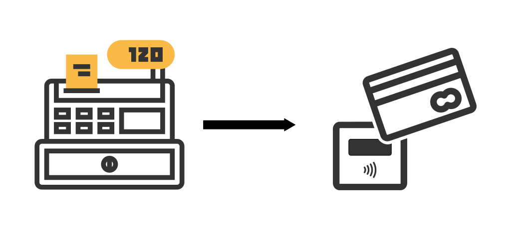

VRP SumUp connector
===================

This utility application connects the SumUp app with the Slovak VRP
virtual till app, allowing you to complete the card payment while issuing
the receipt. The amount will automatically appear in SumUp without the
need to type it in manually.

To install this app, visit its page on [Google Play][0]

To find out more about VRP, see this page (in Slovak): [Virtuálna registračná
pokladnica][1]. The application itself is available from [Google Play][2].

[SumUp][3] is a brand of a lightweight mobile payment terminal by SumUp Payments
Limited. The application is as well available from [Google Play][4]

 [0]: https://play.google.com/store/apps/details?id=me.shadura.vrpconnector
 [1]: https://www.financnasprava.sk/sk/podnikatelia/dane/ekasa/vrp
 [2]: https://play.google.com/store/apps/details?id=sk.financnasprava.vrp
 [3]: https://sumup.co.uk/
 [4]: https://play.google.com/store/apps/details?id=com.kaching.merchant

License
-------

Copyright (C) 2019 Andrej Shadura

This program is free software; you can redistribute it and/or modify it under
the terms of the X11/MIT license as stated below.

Permission is hereby granted, free of charge, to any person obtaining a copy
of this software and associated documentation files (the "Software"), to deal
in the Software without restriction, including without limitation the rights
to use, copy, modify, merge, publish, distribute, sublicense, and/or sell
copies of the Software, and to permit persons to whom the Software is
furnished to do so, subject to the following conditions:

The above copyright notice and this permission notice shall be included in
all copies or substantial portions of the Software.

THE SOFTWARE IS PROVIDED "AS IS", WITHOUT WARRANTY OF ANY KIND, EXPRESS OR
IMPLIED, INCLUDING BUT NOT LIMITED TO THE WARRANTIES OF MERCHANTABILITY,
FITNESS FOR A PARTICULAR PURPOSE AND NONINFRINGEMENT. IN NO EVENT SHALL THE
AUTHORS OR COPYRIGHT HOLDERS BE LIABLE FOR ANY CLAIM, DAMAGES OR OTHER
LIABILITY, WHETHER IN AN ACTION OF CONTRACT, TORT OR OTHERWISE, ARISING FROM,
OUT OF OR IN CONNECTION WITH THE SOFTWARE OR THE USE OR OTHER DEALINGS IN
THE SOFTWARE.
